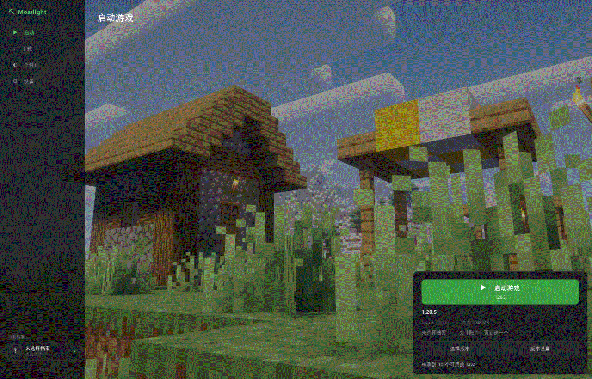
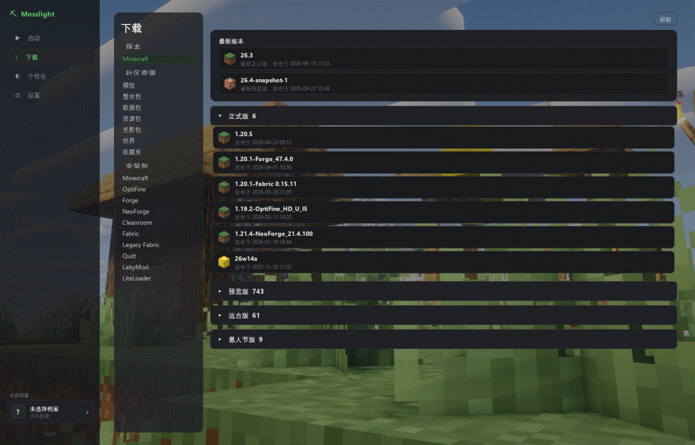
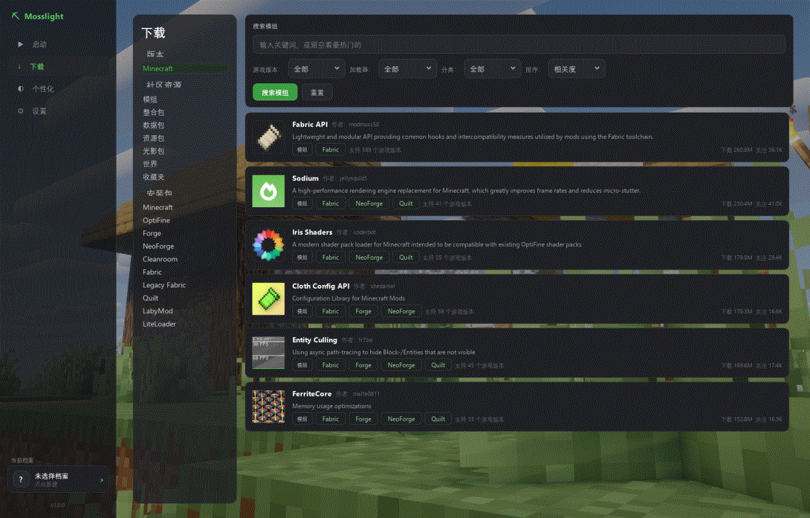
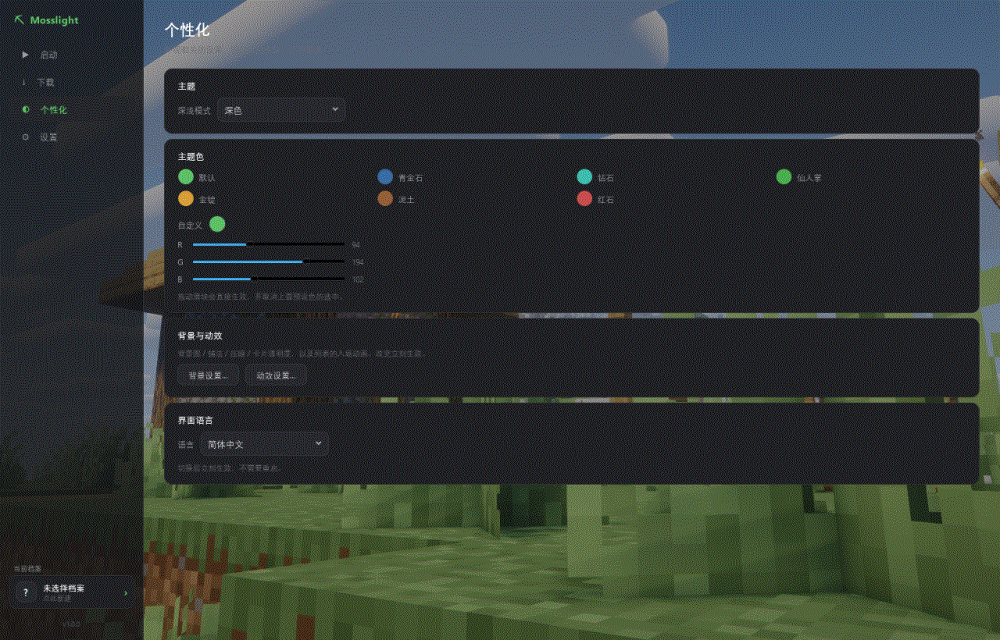
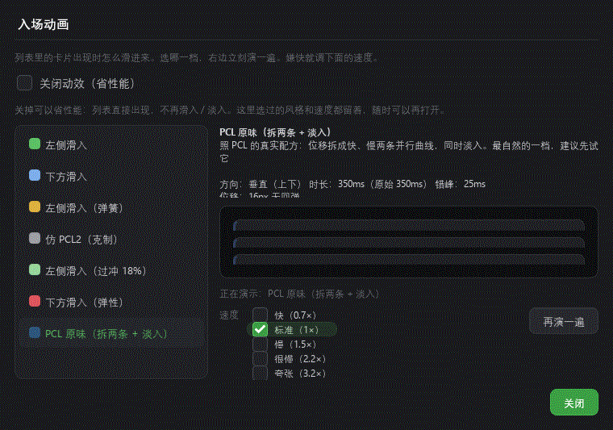

<div align="center">

# 🌿 Mosslight Launcher

**一个用 Python + PyQt6 写的 Minecraft 启动器**

装原版、装加载器、装整合包和模组，然后直接开游戏 —— 都在这一个窗口里。

[](https://github.com/kongxia114/Mosslight-Launcher/releases)
[](LICENSE)
[](https://www.python.org/)
[](https://pypi.org/project/PyQt6/)
[](#下载)

[功能](#功能) · [截图](#截图) · [下载](#下载) · [从源码跑](#从源码跑) · [常见问题](#常见问题) · [自己构建](#自己构建) · [开发笔记](#开发笔记)

</div>

---

自己用的启动器，顺手开源。目标很简单：**把「装一个能玩的整合包」变成三步**，不用先学一身 modloader 黑话。

## 功能

|  |  |
|---|---|
| 🚀 **启动游戏** | 按版本要求自动挑 Java（8 / 17 / 21…）、按物理内存给推荐值、解压 natives、拼启动命令，带日志窗口（按级别过滤）。**一个版本一个独立文件夹**，互不干扰 |
| ⬇️ **下载原版** | 版本清单走 BMCLAPI 镜像；多线程、失败自动重试、镜像连续抽风就熔断 60 秒切官方源 |
| 🧩 **一键装加载器** | Forge / NeoForge / Fabric / Quilt / OptiFine。Forge 那几家要跑官方安装器 —— 启动器会**先把安装器要的库下好**（认 sha1）、失败能续、跑完把版本目录改成 PCL 那套名字（`1.20.1-Forge_47.4.0`） |
| 📦 **一键装整合包** | Modrinth 的 `.mrpack`：解包 → 装原版 → 装加载器 → 铺 `overrides/` → 写一份能直接启动的版本 JSON，进度全在同一个窗口里 |
| 🔍 **社区资源** | 模组 / 整合包 / 数据包 / 资源包 / 光影包 的搜索与下载（数据来自 Modrinth），可按游戏版本 + 加载器 + 分类筛；版本分组可折叠、滚到底自动续 |
| 🎨 **外观** | 深色 / 浅色 / 跟随系统，自定义强调色，背景图（填充 / 适应 / 拉伸 / 居中 / 跨区）+ 压暗，卡片透明度 |
| ✨ **入场动效** | 7 档预设（含复刻 PCL2 的那一档）× 5 档速度；**能整个关掉省性能** —— 不是"把时长设成 0"，是那些开销根本不创建 |
| 🌏 **多语言** | 简体中文 / 繁體中文 / English / 日本語 / Русский，改完立刻生效不用重启 |
| 🧰 **还有** | 离线账户、缺库一键修复、便携模式（旁边放个 `portable.txt` 就变成绿色版）、配置存在 `%APPDATA%\Mosslight` |

> 启动器会在游戏里挂一个版本标识（`Mosslight/Fabric （113 个模组）`），
> 多人游戏里出问题能一眼看出"你装了什么"，不用一个个问。

## 截图

| 启动 | 下载 · 版本列表 |
|---|---|
|  |  |

| 社区资源 | 个性化 · 背景与动效 |
|---|---|
|  |  |

<details>
<summary>动效设置（7 档预设 + 实时预览）</summary>



</details>

## 下载

去 [Releases](https://github.com/kongxia114/Mosslight-Launcher/releases) 拿最新版：

| 包 | 说明 |
|---|---|
| `Mosslight-Launcher-<版本>-win64.zip` | **推荐**。解压就能用，启动快（onedir） |
| `Mosslight-Launcher-<版本>.exe` | 单文件（onefile）。每次启动都要把自己解压到 `%TEMP%`，**冷启动慢 5~10 秒**，介意就别用这个 |

⚠️ 没买代码签名，Windows SmartScreen 会拦一下：「更多信息」→「仍要运行」。
不放心就按下面【从源码跑】自己跑，代码都在这儿。

## 从源码跑

需要 **Python 3.11+**（Windows）：

```powershell
git clone https://github.com/kongxia114/Mosslight-Launcher.git
cd Mosslight-Launcher
pip install -r requirements.txt
python main.py
```

**界面这块一定在本地跑，别走 CI。** 之前我在网页上改一行 QSS，然后等四分钟构建、
下载、解压、双击 —— 调个颜色这么搞是调不动的。

游戏目录默认找 `%APPDATA%\.minecraft`。装在别的盘就在「设置 → 游戏目录」里填；
只想临时试一次也可以设环境变量：

```powershell
$env:MCLUNCHER_MINECRAFT_DIR = "D:\MINECRAFT\.minecraft"
```

## 常见问题

<details>
<summary><b>启动器说「找不到合适的 Java」</b></summary>

按版本要求挑 Java：1.16 及以下要 8，1.17~1.20.4 要 17，1.20.5+ 要 21。
去「设置 → Java」指定一个够版本的，或者去 [Adoptium](https://adoptium.net/) 装一个。
启动器会把机器上所有 Java 列出来，够不够版本它自己判断。
</details>

<details>
<summary><b>下载卡住 / 某个文件一直失败</b></summary>

镜像（BMCLAPI）抽风时会自动切官方源，失败的文件还会再试一轮。
真卡住了就关掉下载窗口重来一次 —— 已经下好的文件会跳过（认 sha1）。
</details>

<details>
<summary><b>装完的整合包 / 加载器在哪？会把我原来的原版弄乱吗？</b></summary>

每个版本一个**独立文件夹**（`versions/1.20.1-Forge_47.4.0/`），里面就是完整的一份，不靠继承。
装加载器时原版会被收进 `<游戏目录>/.mosslight/vanilla/` 藏起来（**不删**），
下次装同一个游戏版本的别的加载器会自动搬回来，不用重下那 25 MB。
自己装的原版、以及还有别的版本继承着它的，一个字都不动。
</details>

<details>
<summary><b>设了背景图之后觉得卡 / 列表发虚</b></summary>

五种铺法里「填充」会把图放大到铺满，大图吃一点显存；
「压暗」调到 90 左右，卡片和字最清楚。
真觉得卡就去「个性化 → 动效设置」把**动效整个关掉**，顺带把每张卡片的离屏合成也省了。
</details>

<details>
<summary><b>配置和账号存在哪？怎么备份 / 搬走？</b></summary>

`%APPDATA%\Mosslight\`（`config.json` + `accounts.json`）。
在启动器旁边放一个 `portable.txt`，它就会把数据放在自己旁边，整个文件夹拷走就能带走。
</details>

<details>
<summary><b>支持正版登录吗？</b></summary>

暂时只支持**离线账户**（正版 / 第三方验证现在只有界面占位，逻辑没写）。
</details>

## 自己构建

```powershell
pip install pyinstaller
python tools/make_version_info.py version_info.txt --version v1.0.0
pyinstaller --noconfirm --windowed --name Mosslight-Launcher `
    --icon assets/icons/icon512.ico --version-file version_info.txt `
    --add-data "assets;assets" main.py
```

或者在 Actions 页面手动跑 `Manual Release`（可以填版本号，会同时出 zip 和单文件 exe，
并从 `CHANGELOG.md` 里自动抓对应那一节当发行说明）。推 `v*` 这种 tag 会触发 `release.yml`。

## 目录

```
main.py                   入口，带全局异常钩子
core/                     业务逻辑 —— 这一层**不 import PyQt6**（所以能脱离界面单独测）
    app_info.py           应用名和版本号，只在这一处
    config.py             全局配置、便携模式、数据目录
    versions.py           扫描 .minecraft/versions
    launch.py             拼启动命令、合继承链、natives、离线 UUID
    branding.py           游戏里那个版本标识（--versionType）
    download.py           下载引擎：镜像、多线程、熔断、重试、备用地址
    install.py            安装流水线（原版 / 加载器 / 整合包）
    loader_setup.py       各家加载器的取数（清单 / 安装器 / maven 坐标）
    loader_install.py     跑官方安装器（Forge / NeoForge / OptiFine）
    standalone.py         合并继承链：一个版本一个自包含文件夹
    modrinth_api.py       社区资源的取数
    appearance.py         背景 / 动效 / 卡片透明度的读写
    anim_prefs.py         动效预设表（时长、位移、错峰、缓动）
    i18n.py               多语言
ui/                       界面
    main_window.py        侧边栏 + 页面堆栈 + 切页动画
    translatable.py       控件基类，管文案登记
    widgets/              卡片、列表行、动画、背景画布…
    pages/  dialogs/
assets/                   主题（QSS 片段）、图标、语言词典
tools/                    文案提取、exe 版本信息生成
```

## 开发笔记

### 改界面文字要走文案系统

不要直接写中文，走 `tr()` / `self.label()`：

```python
self.label("启动游戏", "PageTitle")             # 建控件（自动登记，切语言会跟着变）
self.bind(combo, "搜索版本名…", "placeholderText")
tr("共 {n} 个版本", n=total)                    # 带变量，别用 f-string
```

中文本身就是词典的 key，所以漏翻了顶多退回中文显示，不会把 key 漏到界面上。
列表项、下拉项这类生成的内容要在页面的 `retranslate()` 里重建，并且先调 `super().retranslate()`。

改完跑一下：

```powershell
python tools\extract_strings.py --write    # 补词典、清掉没人用的条目
python tools\extract_strings.py            # 只检查：漏网的裸中文、f-string、打错的 key
```

### 颜色只走主题变量

`assets/styles/parts/*.qss` 里的颜色一律写 `@变量@`（由 `core/theme.py` 在加载时替换），
**不要写死 `#rrggbb`** —— 写死了浅色主题就会漏掉那条规则。
控件自己在代码里 `setStyleSheet` 写死颜色更糟：它的优先级高于全局样式表，从外面盖不掉
（「多线程下载」那块标题栏就这么在浅色主题下变成过一根深色横条）。

### 几个踩过的坑（都是"看起来该生效但没生效"那种）

**打包后的 exe 一直没加载主题。** v0.0.1 到 v0.0.7 七个发行版，界面都是 Qt 默认的浅色。
原因是 `load_styles()` 用了相对路径 `open("assets/styles/dark.qss")`，而 PyInstaller 6
会把 `--add-data` 的东西放进 `_internal/`，双击 exe 时的工作目录又不在那儿；
偏偏 `except FileNotFoundError: pass` 把异常吞了，就这么过去了七个版本。
现在路径统一走 `core/resources.py`，出错也会打印出来。

**纯 QWidget 子类不画 `background-color`**，得先开 `WA_StyledBackground`；
而 `QLabel` 会被全局 `QWidget` 规则染色，得显式设成透明。

**Qt 6.11 会丢掉负数内边距。** 入场动画最早是"给容器布局设负内边距"把卡片推出屏幕外做的，
而 `QLayout.setContentsMargins()` 收到负数会**退回样式默认值**（设 -120、读回来是 11）——
也就是说那套动画在新 Qt 上一直没生效，只是没人盯着逐帧看。现在改成那层不建布局、
直接 `move()` 孩子。

**定高的卡片不能用 `sizeHint()` 当高度。** 搜索结果卡是 `setFixedHeight(96)`，它的
`sizeHint()` 会跟着描述文字长短在 94~122 之间飘，布局按 sizeHint 给高度就会变成
"行距莫名其妙变大"或"卡片底部被切掉"。

### 测试

`core/` 不 import PyQt6 是硬规矩（这一层要能脱离界面单独测）。
界面相关的逻辑基本都能离屏（`QT_QPA_PLATFORM=offscreen`）跑；
离屏没有字体时截图里中文会变成方块 —— 设 `QT_QPA_FONTDIR=C:\Windows\Fonts` 就有字了。

## 还没做的

- **正版 / 第三方登录**：只有界面占位，逻辑没写（现在只有离线账户）
- **世界下载**：Modrinth 压根没有"存档"这个类型，要做只能另找数据源，所以左栏那一项是占位
- **CurseForge**：整合包和模组只接了 Modrinth
- **Windows 以外的平台**：源码理论上能跑（`core/` 是纯 Python），但没测过；打包只做 Windows

## 相关仓库

- [**Mosslight-xperiments**](https://github.com/kongxia114/Mosslight-xperiments) —— 各种原型和试验品：
  早期的启动器版本、纯下载器，还有那个把「背景 + 动效」调出来的 `Downloading mod test`。
  本仓库的界面外观就是从它那儿移植过来的。

## 许可

[GPL-3.0](LICENSE)。

用到的第三方组件（PyQt6 / Python / PyInstaller / requests 等）各自的许可见
「设置 → 关于 → 开源许可」，启动器里列得很清楚。

---

<div align="center">

**Mosslight** · 自己用的，顺手开源

</div>
